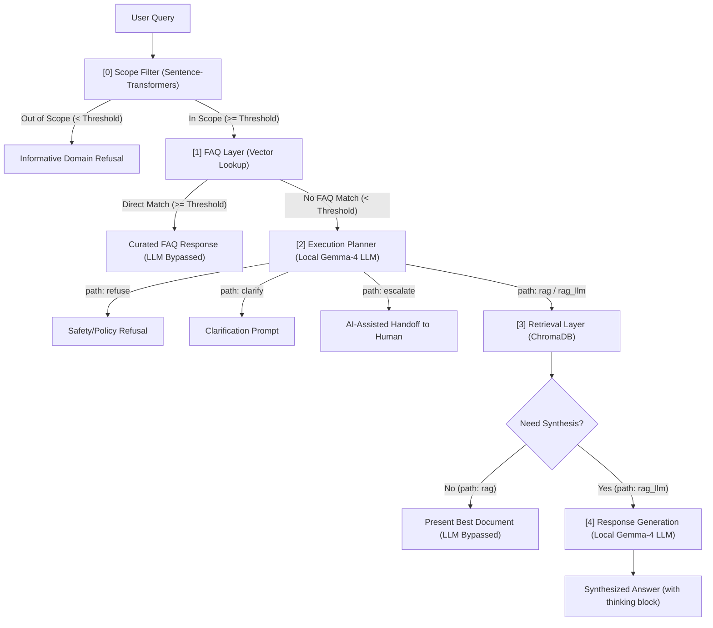

# AI Support Routing System 

---

**E-commerce customer support assistant**

A hybrid, multi-layered support routing engine with intent-bounded semantic guardrails and graceful degradation. This project implements a local-first pipeline designed to classify, retrieve, synthesize, or escalate customer support inquiries based on their scope and complexity.

---

## 📐 System Architecture

The pipeline processes user queries sequentially, ensuring high efficiency, safety, and correctness:



---

## 🛠️ Pipeline Stages

### 0. Scope Filter
* **Model:** Local `all-MiniLM-L6-v2` via `sentence-transformers`.
* **Mechanism:** Computes the cosine similarity of the incoming query against pre-defined intent centroids (derived from `data/intents.json`).
* **Guardrail:** If the similarity score is below the configured **Scope Threshold** (default: `0.40`), it blocks the query immediately and returns a helpful domain refusal explaining supported topics.

### 1. FAQ Layer
* **Mechanism:** Queries a list of high-frequency curated FAQs.
* **Bypass:** If a candidate matches with a similarity score above the **FAQ Match Threshold** (default: `0.80`), the system returns the pre-written answer immediately—completely bypassing the LLM to save tokens and achieve sub-millisecond latencies.

### 2. Execution Planner
* **Model:** Local `Gemma-4-E2B-it` GGUF running on `llama-server.exe`.
* **Mechanism:** The planner classifies the query into one of 5 execution paths:
  1. `refuse`: Safety, prompt injection, or policy refusal.
  2. `clarify`: Query is too vague or ambiguous (e.g., "how much").
  3. `rag`: Simple factual lookup (e.g., order tracking or return window) presented directly.
  4. `rag_llm`: Complex query requiring multi-document synthesis or personalized comparison.
  5. `escalate`: Complex scenarios requiring human intervention (e.g., refund processing, billing disputes).

### 3. Retrieval Layer
* **Database:** Persistent `ChromaDB` vector store.
* **Mechanism:** Queries the top-k relevant knowledge base articles matching the semantic embedding of the query.

### 4. Response Generation (Synthesis)
* **Model:** Local `Gemma-4-E2B-it` GGUF.
* **Mechanism:** For complex queries (`rag_llm`), the LLM synthesizes a grounded answer using *only* the retrieved documents. It includes a visible `<thought>` process block mapping its internal reasoning steps.

---

## ⚙️ Project Setup

### Prerequisites
1. **Python 3.10+** (Virtual environment recommended)
2. **Local Gemma-4 GGUF Model** (`gemma-4-E2B-it-UD-Q4_K_XL.gguf`)
   * **Download Link:** [unsloth/gemma-4-E2B-it-GGUF](https://huggingface.co/unsloth/gemma-4-E2B-it-GGUF) on Hugging Face.
   * Make sure to download the specific file `gemma-4-E2B-it-UD-Q4_K_XL.gguf` (you can download other quantizations if desired).
3. **llama-server.exe** (local LLM runner)
   * **Download Link:** Get the latest release from the official [ggerganov/llama.cpp GitHub Releases](https://github.com/ggerganov/llama.cpp/releases).
   * Select the appropriate Windows release package based on your hardware specs (e.g., `llama-bXXXX-bin-win-cuda-x64.zip` for NVIDIA GPU acceleration or `llama-bXXXX-bin-win-avx64.zip` for CPU execution).
   * Extract the ZIP archive and copy the `llama-server.exe` executable.

### 1. Folder Structure
Ensure the local server binary and GGUF model are placed in the `llama_bin` directory:
```
router/
├── .streamlit/
│   └── config.toml          # Streamlit file watcher configurations
├── data/
│   ├── chroma_db/           # ChromaDB persistent store
│   ├── intents.json         # Intent centroid training examples
│   ├── faqs.json            # Curated FAQs
│   └── kb_documents.json    # Knowledge base documentation
├── llama_bin/
│   ├── llama-server.exe     # local llama.cpp server binary
│   └── gemma-4-E2B-it-UD-Q4_K_XL.gguf
├── app.py                   # Streamlit Frontend application
├── router_logic.py          # Backend Pipeline Routing Logic
└── requirements.txt         # Project Dependencies
```

### 2. Installation
Create a virtual environment and install the required packages:
```bash
# Create virtual environment
python -m venv .venv

# Activate virtual environment
# On Windows (PowerShell):
.venv\Scripts\Activate.ps1
# On Windows (CMD):
.venv\Scripts\activate.bat

# Install dependencies
pip install -r requirements.txt
```

### 3. Running the Server & Streamlit Application
When the Streamlit application starts, the backend logic automatically launches `llama-server.exe` as a background process using the binaries in the `llama_bin` folder.

To start the dashboard:
```bash
streamlit run app.py
```

Open the local URL displayed in the terminal (usually `http://localhost:8501`).

---

## 🖥️ Streamlit UI features

* **💬 Chat Playground:** Submit queries manually or click preset scenarios to observe live routing verdicts.
* **🛠️ Tunable Thresholds:** Tweak the **Scope Threshold** and **FAQ Match Threshold** on-the-fly via sidebar sliders.
* **🔄 Reset System Cache:** Clear active Streamlit states and reload Python file changes instantly without stopping the server.
* **🔍 Detailed Execution Trace:** View detailed step-by-step traces, including:
  - An interactive **Intent Prototype Similarity** bar chart (powered by Altair, with rotated axis labels for readability).
  - Clean breakdowns of FAQ candidates, planner decisions (showing the model's raw JSON layout), and retrieved knowledge articles.
* **📚 Knowledge Base Inspector:** View the raw configurations for Intents, FAQs, and Documents in the final tab.

---

## 🚀 Future Roadmap & Scaling Guidelines

To transition this routing engine from a local prototype to a production-scale enterprise system, consider the following optimization paths:

### 1. Enhancing the RAG Component
As the knowledge base grows to thousands of documents, simple vector similarity can suffer from noise and loss of precision:
* **Semantic Caching:** Implement a semantic cache (e.g., using GPTCache or Redis) to store and instantly serve responses to semantically equivalent user queries, avoiding LLM execution altogether.
* **Hybrid Search (Vector + BM25):** Integrate keyword-based sparse search (BM25) alongside dense vector search. This ensures that exact matches (like model numbers, SKU codes, or technical terms) are retrieved accurately.
* **Re-ranking Layer:** Introduce a secondary re-ranking model (e.g., Cohere Rerank) to evaluate the top retrieval results and re-order them by relevance before passing them to the LLM.

### 2. Model Agnostic Architecture (LLM Layer)
The execution planning and response generation layers are designed to be completely **model-agnostic**:
* **Backend Swapping:** The pipeline communicates via standard OpenAI-compatible API schemas (`/v1/chat/completions`). Swapping local Gemma-4 with other models (like Llama, or cloud models like Gemini, GPT, and Claude) is as simple as updating the `server_url` endpoint and model name keys.
* **Specialized Routing Models:** For high-throughput production, you can replace the planner LLM with a smaller, fine-tuned classification model (e.g., a distilBERT classifier) to decide the execution path in under 10ms.

---

## Reflection

This project is evolved from a standard 'chat with pdf' style project. I studied a lot behind the scene.

RAG is just about memory management. It allows wider context for the LLM to capture. Although the task assigned to the agent is just find the relevant answer, but this can be extended to other areas. And for further usage, we can bind tools or MCP to the agent, this enables agent to do more. For instance, an agent can bind the Gmail tool for reading email and then drafting email to respond customer, while abiding the internal format that can be saved in the state. Though, human-in-loop such as human checking is equally important when the degree of automation rises. 
